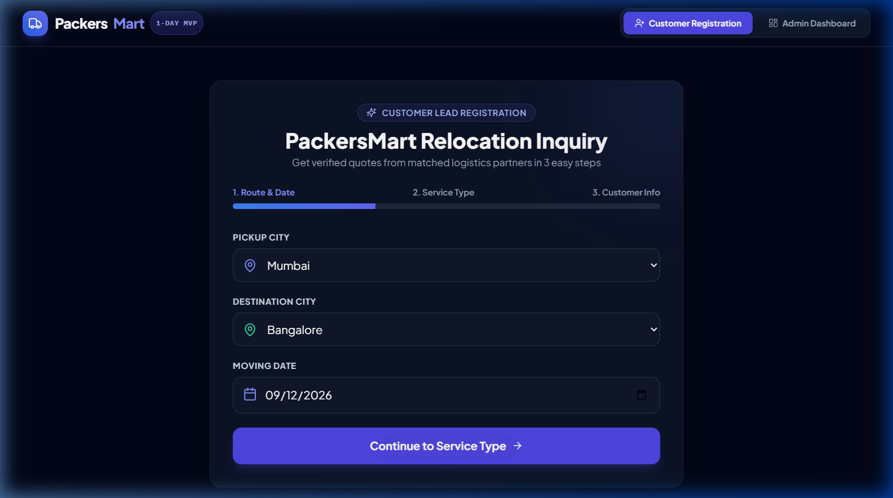
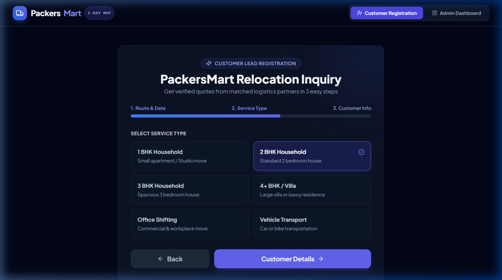
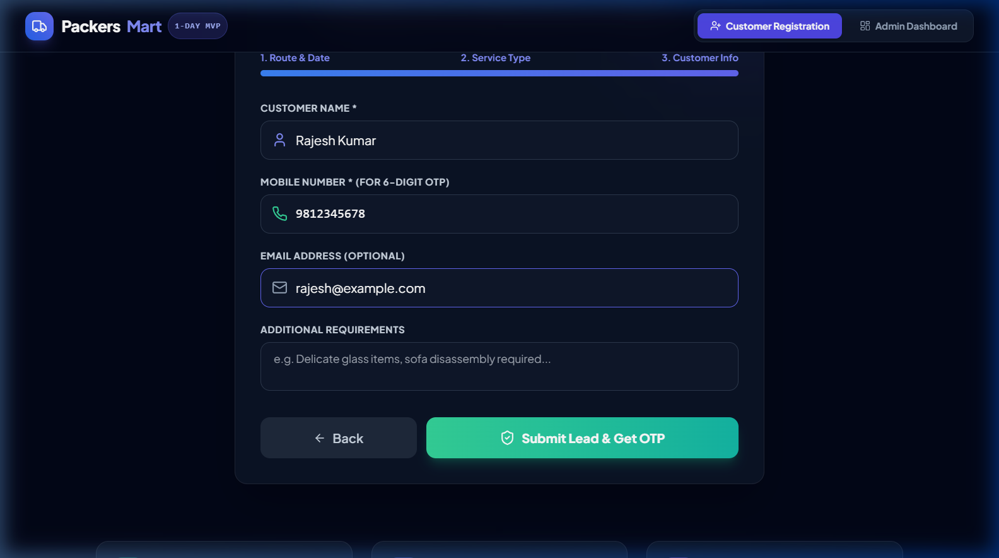
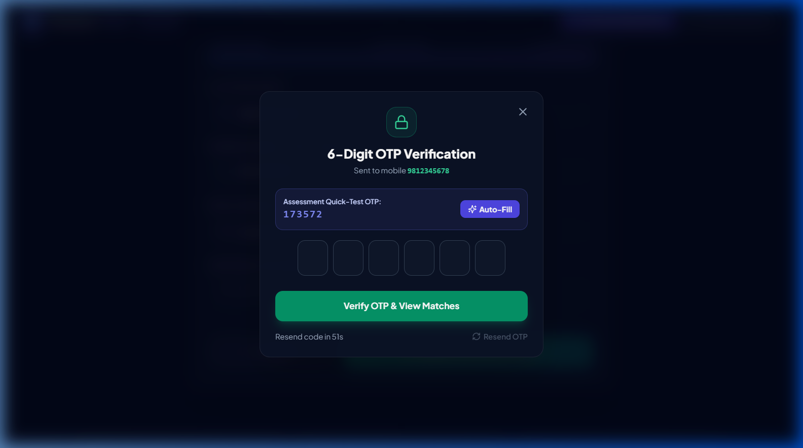
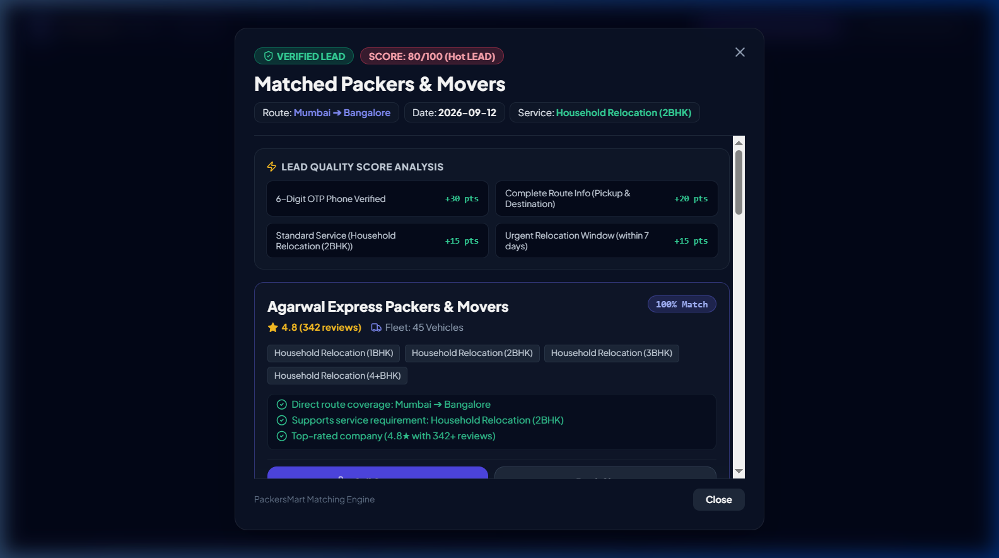
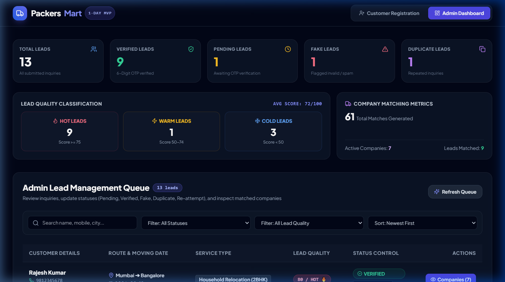
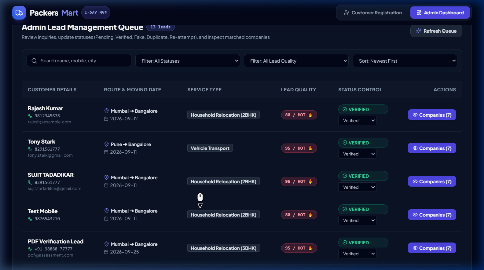
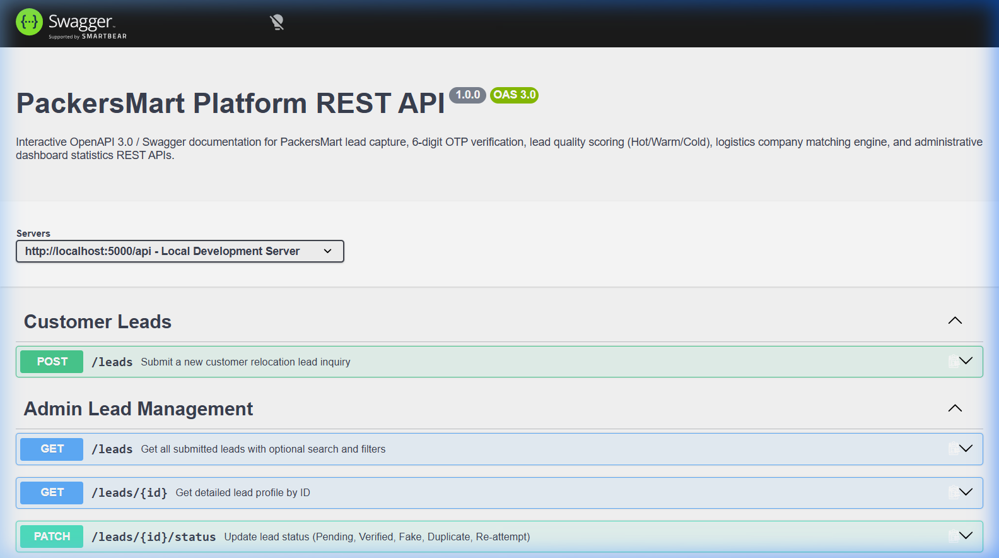

# PackersMart Platform MVP: 1-Day Full-Stack Developer Assessment

An end-to-end working MVP built for the **PackersMart Lead-to-Booking Workflow Assessment Task**. The system captures customer relocation inquiries, performs 6-digit OTP phone verification, calculates lead quality scores (`Hot`, `Warm`, `Cold`), matches verified leads to active logistics companies, and provides administrative monitoring via an interactive dashboard with OpenAPI 3.0 **Swagger UI** interactive documentation.

---

## 📋 Evaluation Checklist & Core Flow

```text
Customer Lead Form ➔ OTP Verification ➔ Verified Lead ➔ Admin Lead Queue ➔ Lead Quality ➔ Company Matching ➔ Dashboard & Swagger Docs
```

| Assessment Section | Requirement | Status | Implementation Details |
| :--- | :--- | :---: | :--- |
| **1. Lead Registration** | Customer Name, Mobile, Email, Pickup City, Destination City, Service Type, Moving Date, Requirements | ✅ | Multi-step form with inline validation (`LeadForm.jsx`) |
| **2. OTP Verification** | 6-digit OTP with expiry time; sets status to `Verified` on success | ✅ | `OtpVerification` model & verification dialog (`OtpModal.jsx`) |
| **3. Admin Dashboard** | Admin queue supporting `Pending`, `Verified`, `Fake`, `Duplicate`, `Re-attempt` | ✅ | Searchable queue table with live status control dropdowns (`LeadTable.jsx`) |
| **4. Lead Quality** | Score calculation (0–100) classifying leads as `Hot`, `Warm`, or `Cold` | ✅ | Multi-signal scoring engine (`scoringService.js`) |
| **5. Company Matching** | 5–10 companies seeded; matched by Pickup City, Destination, and Service Type | ✅ | 8 seeded logistics companies + rule-based matching engine (`matchingService.js`) |
| **6. Dashboard Stats** | Total Leads, Verified, Fake, Duplicate, Pending, Hot/Warm/Cold counts, Company matches | ✅ | Dynamic real-time statistics cards (`DashboardStats.jsx`) |
| **7. REST APIs** | Section 7 endpoint specifications (`/api/leads`, `/api/leads/:id/verify-otp`, `/api/dashboard`, etc.) | ✅ | Pure JSON REST API routes (`api.js`) |
| **Swagger UI Docs** | Interactive OpenAPI 3.0 API documentation & sandbox | ✅ | `swagger-ui-express` & `swagger-jsdoc` at `http://localhost:5000/api-docs` |

---

## 📸 Screenshots of Application

Below are stepwise screenshots demonstrating the complete end-to-end PackersMart application workflow:

### Step 1: Customer Relocation Inquiry - Route & Date Selection
Captures Pickup City, Destination City, and preferred Moving Date with inline validation.



---

### Step 2: Customer Relocation Inquiry - Service Type Selection
Allows customers to select inventory volume / service requirement (1 BHK, 2 BHK, 3 BHK, 4+ BHK, Office Shifting, Vehicle Transport).



---

### Step 3: Customer Contact Information & Submission
Collects Customer Name, Mobile Number (for 6-digit OTP verification), Email Address, and Special Requirements before form submission.



---

### Step 4: 6-Digit OTP Verification Screen
Displays the 6-digit OTP verification dialog with countdown timer, resend trigger, and built-in **Assessment Quick-Test OTP Auto-Fill** shortcut.



---

### Step 5: Verified Lead Inquiry & Matched Packers & Movers Recommendations
Renders verified status badge, lead quality score breakdown (+30 OTP, +20 Route, +15 Service, +15 Date), and top matched logistics companies with match scores %, ratings, fleet sizes, and call/book action buttons.



---

### Step 6: Admin Operations Dashboard - Executive KPI Statistics Cards
Provides real-time operational statistics cards displaying Total Leads, Verified Leads, Pending Leads, Fake Leads, Duplicate Leads, Lead Quality breakdown (Hot/Warm/Cold), and Active Logistics Companies.



---

### Step 7: Admin Operations Lead Queue & Status Controls
Filterable and searchable lead management queue table showing customer details, route, service type, lead quality badges (`HOT`, `WARM`, `COLD`), live status transition dropdown selectors (`Pending`, `Verified`, `Fake`, `Duplicate`, `Re-attempt`), and company match openers.



---

### Step 8: Interactive Swagger UI API Documentation (`http://localhost:5000/api-docs`)
Provides interactive OpenAPI 3.0 API documentation allowing developers to inspect endpoints, schemas, request payloads, response codes, and test API endpoints directly from the browser sandbox.



---

## 🏗️ Selected Technology Stack

- **Frontend:** React 18 (Vite), Tailwind CSS, Lucide React icons, Axios
- **Backend:** Node.js, Express.js, REST JSON APIs
- **API Documentation:** Swagger UI (`swagger-ui-express`) & OpenAPI 3.0 JSDoc (`swagger-jsdoc`)
- **Database & ORM:** Prisma ORM with SQLite (`dev.db`) for zero-setup local execution
- **Database SQL Export:** Standard ANSI SQL export provided in [`schema.sql`](file:///f:/PackersMartPlatform/schema.sql)

---

## 📁 Project Structure

```text
PackersMartPlatform/
├── docs/                         # Application Documentation & Screenshots
│   └── screenshots/              # Stepwise UI Workflow Screenshots
│       ├── 01_lead_form_step1_route.png
│       ├── 02_lead_form_step2_service.png
│       ├── 03_lead_form_step3_customer_info.png
│       ├── 04_otp_verification_modal.png
│       ├── 05_matched_companies_modal.png
│       ├── 06_admin_dashboard_kpis.png
│       ├── 07_admin_lead_queue_table.png
│       └── 08_swagger_ui_api_docs.png
├── server/                       # Node.js / Express Backend
│   ├── prisma/
│   │   ├── schema.prisma         # Relational schema (Lead, OtpVerification, Company, LeadCompanyMatch)
│   │   └── seed.js               # 8 Logistics Companies & Sample Leads Seeder
│   ├── src/
│   │   ├── services/
│   │   │   ├── scoringService.js  # Lead Quality Scoring (Hot, Warm, Cold)
│   │   │   └── matchingService.js # Pickup / Destination / Service Matching Engine
│   │   ├── controllers/
│   │   │   ├── leadController.js  # Lead CRUD & status management
│   │   │   ├── otpController.js   # 6-digit OTP generation & verification
│   │   │   └── dashboardController.js # Dynamic statistics aggregations
│   │   ├── routes/
│   │   │   └── api.js            # Express API Route definitions & OpenAPI JSDoc
│   │   ├── swagger.js            # Swagger UI & OpenAPI 3.0 Configuration
│   │   └── app.js                # Express Server Listener
│   └── package.json
├── client/                       # React / Vite Frontend
│   ├── src/
│   │   ├── components/
│   │   │   ├── LeadForm.jsx      # Customer Lead Form with validation
│   │   │   ├── OtpModal.jsx      # 6-Digit OTP verification modal
│   │   │   ├── DashboardStats.jsx# Section 6 Statistics cards
│   │   │   ├── LeadTable.jsx     # Section 3 Admin queue & status switcher
│   │   │   └── CompanyMatchesModal.jsx # Company recommendations viewer
│   │   ├── api/
│   │   │   └── axiosClient.js
│   │   ├── App.jsx               # Application layout & portal switcher
│   │   └── index.css
│   └── package.json
├── schema.sql                    # SQL DDL File (Section 8 suggested tables)
└── README.md                     # Documentation
```

---

## ⚡ Setup & Execution Instructions

### 1. Backend Server Setup (`server/`)
```bash
cd server
npm install
npx prisma db push
node prisma/seed.js
npm run dev
```
*Backend API will run on **`http://localhost:5000`**.*  
*Interactive Swagger UI API Docs will run on **`http://localhost:5000/api-docs`**.*

### 2. Frontend Application Setup (`client/`)
```bash
cd client
npm install
npm run dev
```
*Frontend Portal will run on **`http://localhost:3000`**.*

---

## 🧠 Business Logic Explanation

### 1. Lead Quality Scoring (`scoringService.js`)
Calculates a composite quality score between `0 and 100`:
- **OTP Verification (+30 pts):** Phone number verified via 6-digit OTP.
- **Route Information (+20 pts):** Pickup City and Destination City provided.
- **Service Type Weighting (+15 to +20 pts):** High-volume services (3BHK, 4+BHK, Office Shifting) receive +20 pts.
- **Moving Date Window (+15 pts):** Relocation within 7 days (+15 pts) vs 30 days (+10 pts).
- **Special Requirements (+15 pts):** Additional requirements/instructions declared.

**Lead Quality Classification:**
- 🔥 **Hot:** Score `>= 75`
- ⚡ **Warm:** Score `50 - 74`
- ❄️ **Cold:** Score `< 50`

### 2. Company Matching Engine (`matchingService.js`)
Rule-based matching algorithm that connects verified leads with companies where:
1. `Company.status` is **Active**.
2. Company `coverage` includes **Pickup City** or **Destination City**.
3. Company `serviceTypes` supports the lead's **Service Type**.
4. Applies match scoring based on direct route availability (+25 pts), service compatibility (+10 pts), and company rating (`>= 4.7★` +5 pts).

---

## 🔌 API Endpoint Reference & Swagger UI

Interactive OpenAPI 3.0 Swagger UI Sandbox is served live at:  
👉 **`http://localhost:5000/api-docs`** (JSON spec at `http://localhost:5000/api-docs.json`)

| Method | Endpoint | Purpose | Swagger Tag |
| :--- | :--- | :--- | :--- |
| `POST` | `/api/leads` | Create a new customer lead inquiry | `Customer Leads` |
| `POST` | `/api/leads/:id/verify-otp` | Verify 6-digit OTP for lead | `OTP Verification` |
| `GET` | `/api/leads` | Get all submitted leads with status filters | `Admin Lead Management` |
| `GET` | `/api/leads/:id` | Get single lead details | `Admin Lead Management` |
| `PATCH` | `/api/leads/:id/status` | Update lead status (`Pending`, `Verified`, `Fake`, `Duplicate`, `Re-attempt`) | `Admin Lead Management` |
| `GET` | `/api/leads/:id/matching-companies` | Get suitable company matches for lead | `Company Matching Engine` |
| `GET` | `/api/dashboard` | Get dynamic dashboard statistics | `Admin Dashboard Statistics` |
